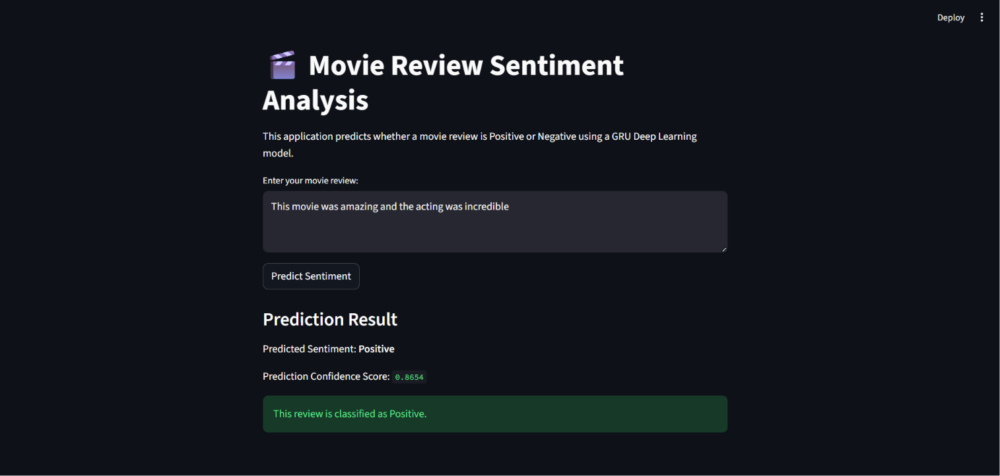

# 🎬 Movie Review Sentiment Analysis System

A Deep Learning NLP project that predicts whether a movie review is **Positive** or **Negative** using Recurrent Neural Networks.

## Project Overview

This project implements a complete **Sentiment Analysis System** for movie reviews using the IMDb Movie Reviews Dataset.

The goal is to classify user reviews into:

- Positive
- Negative

The project includes:

- Data preprocessing
- Building and comparing multiple Deep Learning models
- Performance evaluation
- Error analysis
- Interactive prediction demo using Streamlit

---

## Dataset

**IMDb Movie Reviews Dataset**

- 50,000 labeled movie reviews
- Balanced dataset
- Binary sentiment classification
- Training samples: 25,000
- Testing samples: 25,000

Dataset source:

TensorFlow / Keras IMDb Dataset

---

## Project Workflow

### 1. Data Preprocessing

The following preprocessing steps were applied:

- Loading IMDb dataset
- Limiting vocabulary size to top 10,000 words
- Converting words into integer sequences
- Padding/truncating reviews to fixed length (200 words)

---

### 2. Deep Learning Models

Three different recurrent architectures were implemented and compared:

#### Simple RNN
Basic recurrent neural network architecture.

Architecture:
- Embedding Layer
- SimpleRNN Layer
- Dropout
- Dense Output Layer

---

#### LSTM
Long Short-Term Memory network for handling long-term dependencies.

Architecture:
- Embedding Layer
- LSTM Layer
- Dropout
- Dense Output Layer

---

#### GRU
Gated Recurrent Unit architecture.

Architecture:
- Embedding Layer
- GRU Layer
- Dropout
- Dense Output Layer

---

## Results

| Model | Test Accuracy | Test Loss |
|------|--------------|-----------|
| Simple RNN | 51.2% | 0.8545 |
| LSTM | 77.4% | 0.5027 |
| GRU | 85.1% | 0.3710 |

### Best Model

**GRU achieved the best performance.**

Reason:
- Faster training than LSTM
- Better handling of sequential dependencies
- Strong generalization performance

---

## Error Analysis

### Why Simple RNN performed poorly

Simple RNN struggled due to:

- Vanishing Gradient Problem
- Weak memory for long sequences
- Poor handling of long movie reviews

---

## Prediction Demo

The project includes an interactive Streamlit application where users can enter custom movie reviews and receive sentiment predictions instantly.

Example:

Input:
```text
This movie was amazing and the acting was incredible
```

Output:
```text
Positive
```

---

## Project Structure

```bash
sentiment-analysis-system/
│
├── app/
│   └── app.py
│
├── models/
│   └── gru_weights.weights.h5
│
├── notebooks/
│   └── sentiment_analysis_training.ipynb
│
├── requirements.txt
└── README.md
```

---

## Installation

Clone repository:

```bash
git clone https://github.com/nahlarashad/sentiment-analysis-system.git
cd sentiment-analysis-system
```

Install dependencies:

```bash
pip install -r requirements.txt
```

---

## Run Streamlit App

```bash
python -m streamlit run app/app.py
```

---

## Technologies Used

- Python
- TensorFlow / Keras
- NumPy
- Streamlit
- Google Colab
- GitHub
- VS Code

---

## Future Improvements

Possible enhancements:

- Add attention mechanism
- Deploy online using Streamlit Cloud
- Add confidence visualization
- Improve preprocessing with advanced NLP cleaning
- Support multi-class sentiment classification

## Application Demo

### Streamlit Interface



---

## Author

**Nahla Rashad**

AI & Data Analyst  
Computer Science and Artificial Intelligence Student — Cairo University